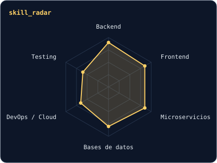
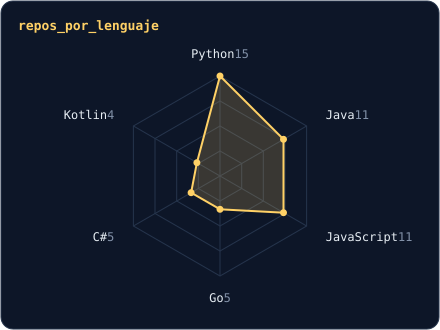

<a href="https://github.com/kevinseya">
  <picture>
    <source media="(prefers-color-scheme: dark)" srcset="assets/banner-dark.svg">
    <source media="(prefers-color-scheme: light)" srcset="assets/banner-light.svg">
    
  </picture>
</a>

 

---

## `$ whoami`

Ingeniero en Sistemas que disfruta construir **servicios robustos, seguros y escalables**: arquitecturas de microservicios, sistemas distribuidos, APIs REST / GraphQL / SOAP / gRPC y frontends modernos. Hoy trabajo en sistemas académicos y en proyectos con integración continua y despliegue en la nube.

 

## `$ cat tech-stack.yaml`

<table>
  <thead>
    <tr>
      <th colspan="2" align="left"><code>kevinseya:~$ cat tech-stack.yaml</code></th>
    </tr>
  </thead>
  <tbody>
    <tr>
      <td width="50%" valign="top"><code>├─ ✦ languages:</code>  
         
        <code>Java · Python · TypeScript · JavaScript · Go · C# · Kotlin</code>
      </td>
      <td width="50%" valign="top"><code>├─ ◈ frontend:</code>  
         
        <code>React · React Native · Angular · Tailwind · Bootstrap · Vite</code>
      </td>
    </tr>
    <tr>
      <td valign="top"><code>├─ ⚙ backend_apis:</code>  
         
        <code>Node.js · Spring Boot · .NET · FastAPI · Flask · GraphQL · Socket.io</code>
      </td>
      <td valign="top"><code>├─ ▣ databases:</code>  
        
         
        <code>PostgreSQL · MySQL · MongoDB · Oracle · SQL Server · CouchDB</code>
      </td>
    </tr>
    <tr>
      <td valign="top"><code>├─ ☁ devops_cloud:</code>  
         
        <code>Docker · AWS · GitHub Actions · Terraform · Git · Linux</code>
      </td>
      <td valign="top"><code>╰─ ⌁ learning_now:</code>  
         
        <code>Jenkins · NestJS · Kotlin</code>
      </td>
    </tr>
  </tbody>
  <tfoot>
    <tr>
      <td colspan="2"><code>status: ready&nbsp;&nbsp;·&nbsp;&nbsp;environment: production&nbsp;&nbsp;·&nbsp;&nbsp;region: ec-quito-1</code></td>
    </tr>
  </tfoot>
</table>

---

## `$ kubectl get signals --all-namespaces`

  <picture>
    <source media="(prefers-color-scheme: dark)" srcset="assets/radar-dark.svg">
    <source media="(prefers-color-scheme: light)" srcset="assets/radar-light.svg">
    
  </picture>&nbsp;
  <picture>
    <source media="(prefers-color-scheme: dark)" srcset="assets/radar-langs-dark.svg">
    <source media="(prefers-color-scheme: light)" srcset="assets/radar-langs-light.svg">
    
  </picture>

<code>signals: skill_radar · repos_por_lenguaje · status: healthy</code>

---

## `$ git log --stats`

  
  

---

<!-- SOCIALS -->
## `$ connect --socials`

&nbsp;&nbsp;
&nbsp;&nbsp;

 
 

Hecho con ☕ y mucho código desde Quito, Ecuador 🇪🇨 · @kevinseya

